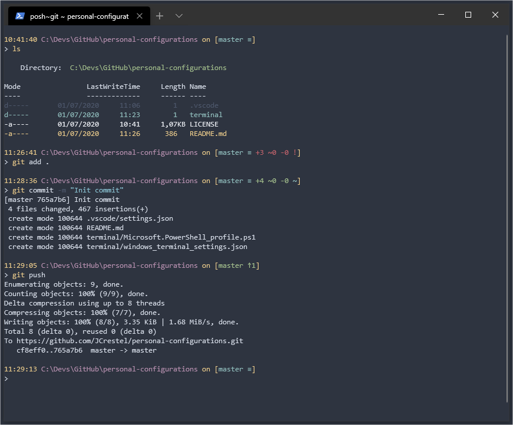

# Personal configurations

My personal configurations for dev purpose (Windows Terminal, VS Code, Intellij)

## Theme & Font

The theme i use everywhere is : [North](https://www.nordtheme.com/ports/visual-studio-code)  

The font i use almost everywhere is : [Fira Code](https://github.com/tonsky/FiraCode)

## Windows Terminal

I use [posh git](https://github.com/dahlbyk/posh-git) and [PSColor](https://github.com/Davlind/PSColor) to customize my Powershell profile.  

Here a preview of my terminal :  

